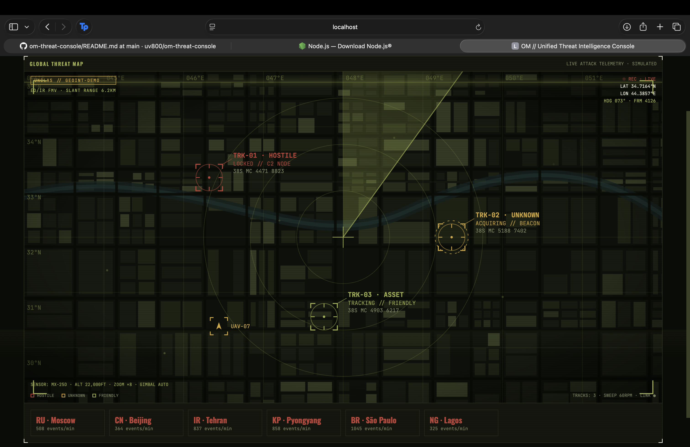
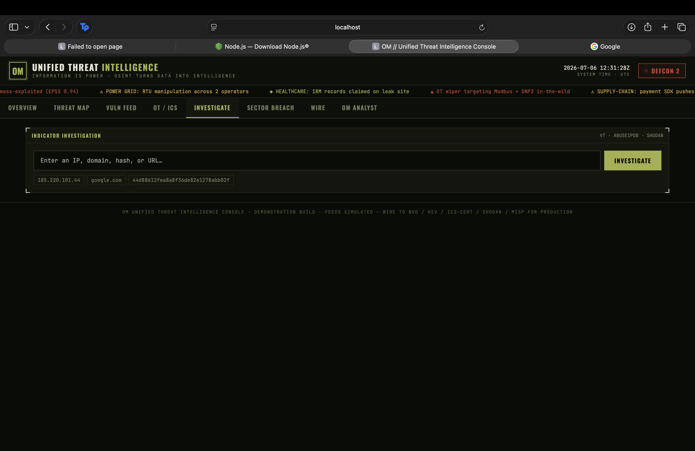
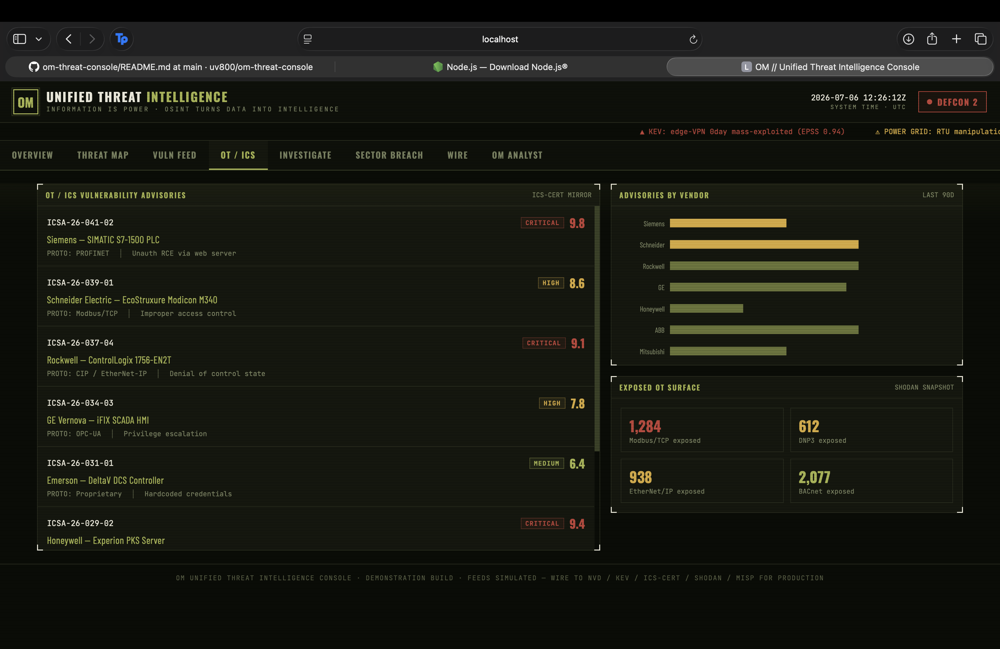

# OM // Unified Threat Intelligence Console


A military-tactical OSINT / cyber threat-intelligence dashboard. Dark olive-drab
HUD theme with a GEOINT satellite tactical map, a real-time vulnerability feed,
OT/ICS advisories, sector-wise breach analytics, a cyber-attack wire, and **OM**
— an embedded AI intelligence analyst for threat hunting, investigation, incident
response, OSINT, and sandbox work.

Runs on **simulated data out of the box** — no keys required. Live intel feeds
and the OM model call are opt-in.
# 📸 Screenshots

## 🖥️ Overview Dashboard

A unified command center providing a real-time view of global threat intelligence, vulnerabilities, OT/ICS security, cyber attack telemetry, and AI-assisted operations.

<p align="center">
  
</p>

---

## 🤖 OM AI Analyst

The built-in AI cybersecurity analyst for threat hunting, IOC enrichment, OSINT correlation, incident response, and contextual security recommendations.

<p align="center">
  
</p>

---

## 🔍 Threat Investigation

Investigate IPs, domains, hashes, CVEs, and indicators of compromise with enriched intelligence gathered from multiple security sources.

<p align="center">
  
</p>

---

## 🏭 OT / ICS Security Dashboard

Monitor industrial cybersecurity advisories, OT assets, ICS vulnerabilities, and operational technology security posture.

<p align="center">
  
</p>

---

## 🚨 Vulnerability Intelligence Feed

Track newly disclosed vulnerabilities with severity ratings, exploitation status, affected products, and remediation guidance.

<p align="center">
  
</p>

---
## Quick start

```bash
npm install
npm run dev
```

Open http://localhost:5173. The map, CVE stream, breach dashboard, and wire are
live immediately on demo data. OM answers from its built-in playbook until you
connect a model (below).

## Turn on OM (live AI analyst)

OM talks to Anthropic through a tiny proxy (`server.js`) so your API key stays
server-side.

```bash
cp .env.example .env          # add ANTHROPIC_API_KEY=sk-ant-...
npm start                     # runs the OM proxy + Vite together
```

`npm start` launches `server.js` on :8787 and Vite on :5173; Vite proxies
`/api/*` to it. Without a key, OM silently falls back to its offline playbook.

## Investigation / indicator enrichment

The **Investigate** tab (and OM in chat) run live IOC lookups across VirusTotal,
AbuseIPDB, and Shodan, then correlate them into a single scored verdict.

- Enter an **IP, domain, hash, or URL** → the backend detects the type, fans out
  to each source in parallel, and returns MALICIOUS / SUSPICIOUS / LOW-RISK /
  CLEAN with the evidence (VT detections, AbuseIPDB confidence, open ports, CVEs).
- **OM does it too:** ask "investigate 185.220.101.44" on the OM Analyst tab and
  OM calls the `enrich_indicator` tool, reads the real results, and writes the
  verdict — it does not guess reputation from memory.

Runs in **demo mode with no keys** (results flagged `DEMO DATA`). Add any of
`VIRUSTOTAL_API_KEY`, `ABUSEIPDB_API_KEY`, `SHODAN_API_KEY` to `.env` to enable
real lookups. Requires the backend running (`npm start`).

Endpoint: `POST /api/enrich { "indicator": "..." }` → correlated report.

## Turn on live intel feeds (dashboard panels)

Set `VITE_USE_LIVE_FEEDS=true` in `.env` and add the relevant keys. The
vulnerability panel then pulls from NVD + CISA KEV; the other connectors
(ICS-CERT, Shodan, MISP) are stubbed in `src/feeds/` ready to wire the same way.

> NVD, CISA, Shodan, and MISP should be called from a backend (CORS + key
> hygiene). `server.js` shows the proxy pattern — add routes there and point the
> connectors at them for production.

## Project layout

```
├─ index.html
├─ server.js                 OM proxy (Anthropic key injected server-side)
├─ vite.config.js            dev server + /api proxy
├─ .env.example
└─ src/
   ├─ main.jsx
   ├─ App.jsx                the whole console (theme, UI, mock generators)
   └─ feeds/
      ├─ index.js            live/mock switch + connector contract
      ├─ normalize.js        shared shapes (CVSS→severity, CVE mapping)
      ├─ nvd.js              NVD + CISA KEV  → vulnerability feed
      ├─ icscert.js          CISA ICS-CERT   → OT/ICS advisories
      ├─ shodan.js           Shodan          → exposed OT surface
      └─ misp.js             MISP            → threat events / map telemetry
├─ enrich.js                 investigation engine (VT + AbuseIPDB + Shodan)
```

## Panels

- **Overview** — KPI tiles, GEOINT map, live vuln feed, OM chat, wire.
- **Threat Map** — GEOINT satellite feed: radar sweep, target-lock reticles
  (HOSTILE / UNKNOWN / FRIENDLY), moving UAV contact, MGRS grid, live HUD.
- **Vuln Feed** — streaming CVEs with CVSS, CWE, EPSS, KEV flags; severity mix;
  KEV patch-SLA queue.
- **OT / ICS** — ICS-CERT-style advisories, advisories-by-vendor, exposed-OT
  protocol counts (Modbus, DNP3, EtherNet/IP, BACnet).
- **Sector Breach** — color-coded cards + bar chart by sector (Healthcare,
  Power Grid, Financial, Manufacturing, Government, Telecom, Water, Transport).
- **Wire** — multi-source cyber-attack news tagged by sector and severity.
- **OM Analyst** — full-screen chat with capability modules.

## Notes

- Demo data is clearly labeled in the footer. Swap it via `src/feeds/`.
- OM is defensive-only by design (blue-team playbooks, MITRE ATT&CK, IR phases).
- Requires Node 18+ (uses global `fetch`).

## Build

```bash
npm run build && npm run preview
```
---

---

## 📄 Copyright & Disclaimer

**© 2026 Urvish Atul Bhatti. All Rights Reserved.**

OM // Unified Threat Intelligence Console is an independent personal project created for learning, research, and portfolio purposes.

This project was developed entirely outside of my employment and does not contain proprietary code, confidential information, trade secrets, or intellectual property belonging to any employer.

The application uses simulated/demo data and is intended solely to demonstrate cybersecurity, OT/ICS, threat intelligence, and AI-assisted workflow concepts.

This repository is provided for educational and portfolio purposes only. Unauthorized commercial use, redistribution, or reproduction of this work without prior written permission is prohibited.
